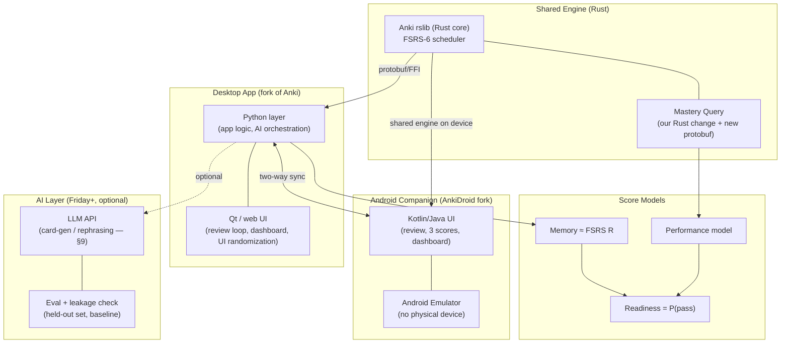

# PRD — Week 2: "Speedrun" USMLE Step 1 Study App (Desktop + Android on one Anki engine)

> **One-line:** Fork Anki, pick **USMLE Step 1**, build a **desktop app + Android companion** that share **one Rust engine**, measure **Memory / Performance / Readiness** separately and honestly, make a **real Rust engine change**, and **prove** one learning-science feature with a fair test.

This PRD is the source of truth for *what gets done in which phase*. The phase a feature is listed under is a contract: **do not pull a later-phase feature forward, and do not slip an earlier-phase feature back.** "No Sunday work on Tuesday."

---

## 1. Persona & Product Goal

**Primary persona — "The Step 1 grinder":**
- A medical student studying for **USMLE Step 1**, studying seriously (>6 hr/day) over a **1–2 month** dedicated period.
- Studies in **two places**: at a desk (desktop) and on the phone between classes (Android companion).
- Wants to use the app **every day until the exam**, then have the app behave correctly **in the final 1–3 days** before the exam.
- Cares about **long-term retention**, not just passing, because **Step 1 knowledge is the foundation for future USMLE steps** (Step 2/3 are scored, not pass/fail), so durable memory matters *more* than the Step 1 result itself.

**Product goal:** Help this student (a) learn for the long term during the main study period, (b) honestly know how ready they are to **pass**, and (c) shift toward short-term performance in the last few days — while never showing a dishonest readiness number.

---

## 2. Locked Decisions (from interview)

| Decision | Choice |
|---|---|
| Exam | **USMLE Step 1** (pass/fail since Jan 26, 2022) |
| Mobile platform | **Android via AnkiDroid** (open source, AGPL, shares the Rust engine), run on an **Android emulator** (no physical device required) |
| Committed Rust engine change | **Mastery query** — backend call returning, per topic, # cards mastered + average recall, fast enough to power the dashboard on 50,000 cards |
| Tested study feature (3-build ablation) | **SPOV2 — Forced UI randomization** (strip environmental cues) |
| Readiness output | **Probability of passing** (per horizon; a probability, so **no separate range**) + % of exam outline covered + confidence + "how sure" + last-updated + reasons + give-up rule. Uncertainty lives on the **Performance** input (weight-band, §6e). **No invented numeric score.** |
| Long-term ↔ short-term mode | **Manual toggle shipped Wednesday.** Near-exam behavior = **recommendation notice** ("exam is close — consider switching to short-term mode"), **never auto-disable**. |
| Primary AI feature (Friday) | **OPEN DECISION — see §9.** (card generation vs. AI rephrasing) |
| Team | **Solo developer, fresh start** (Anki fork happens in Phase 0) |

---

## 2b. Tech Stack (at a glance)



> One Rust engine feeds **both** apps. AI is an optional layer (off by default); both apps must score with AI switched off.

---

## 3. Spiky Points of View (from the BrainLift) → Features

These are the opinionated bets the product is built on. Each maps to a concrete feature and a phase.

- **SPOV1 — Disable long-term features 1–3 days before the exam.** Within 1–3 days, short-term performance matters at least as much as long-term learning; long-term mode hurts short-term performance. → **Manual mode toggle (Wed)** + **near-exam recommendation notice (Sun)**. (We do *not* auto-disable; we *recommend*.)
- **SPOV2 — Force UI randomization** (colors, sizes, fonts, line breaks) every day / every question, so students can't lean on environmental cues that won't exist in the real exam UI. → **The tested study feature (Wed builds the feature; Sun proves it).** *Constraint: keep randomization subtle/bounded — it must strip environmental cues without becoming a distraction that hurts reading or recall. Stay within readable ranges (legible color contrast, sane font sizes, no jarring layouts); the goal is removing cue-reliance, not degrading legibility.* *Difficulty-gated: apply font/size/color randomization **only on easy cards (low FSRS difficulty)** to add a small desirable difficulty and trigger deeper encoding. On **hard cards (high difficulty)**, disable it — extra visual load there backfires, adding distraction on top of already-hard material.*
- **SPOV3 — Readiness weights recent short-term performance on top of baseline long-term memory.** Recent pre-exam studying raises real exam performance, so projected readiness should sit above what long-term memory alone predicts. → **Readiness model (Wed honest v1; Sun calibrated).**
- **SPOV4 — Generation-forcing + AI rephrasing** reduce environmental cues and trigger deeper encoding (type/wait before reveal; AI rephrases card text on reappearance). → **Generation-forcing (deferred to Sunday/Phase 3, no AI; optional)**; **AI rephrasing is a candidate for the Friday AI feature (see §9).**

**Learning-science anchors (for the Brainlift / model notes):** Roediger & Karpicke (retrieval practice), E. & R. Bjork (desirable difficulties, varying conditions of practice), Soderstrom & Bjork (learning vs. performance), Rohrer & Taylor (spacing nil at 1 week, large at 4 weeks → justifies turning long-term features off only in the final 1–3 days).

---

## 4. Non-Goals (explicitly out of scope for Week 2)

- **Overlearning features** — too much extra work for a busy student; out of scope.
- **New short-term-performance features beyond what Anki already does** — Anki's "Easy" skim already covers fast short-term review; do not reinvent it.
- **A numeric Step 1 "score."** Step 1 is pass/fail — inventing a number is an **automatic fail** per the spec.
- **A long catalog of every long-term-learning strategy** — Anki covers many; pick the few SPOVs above.
- **Real-time (<1s) sync, E2E-encrypted sync, 100k cards, multi-OS notarized installers, upstream PR acceptance** — these are §13 "feature ideas," only if the core is solid. Not committed this week.

---

## 5. Honesty Rules & Give-Up Rule (apply to ALL phases)

The app **may not show a readiness score** unless it can simultaneously show:
- what evidence produced the number,
- what data is still missing,
- how accurate past guesses turned out to be,
- the **range** of likely outcomes (not one number),
- the **single best next thing to study**.

**Give-up rule (must be written down and enforced from Wednesday):**
> The app shows **no readiness score** until the student has at least **200 graded reviews** AND **≥ 50% coverage of the Step 1 content outline**. Below either line, the app abstains and instead shows "not enough data yet" + what's missing.

(Thresholds are the working default; tune with data by Sunday and document any change.)

---

## 5b. Background — What FSRS Already Gives Us (and What It Doesn't)

Anki ships **FSRS-6** (Free Spaced Repetition Scheduler) as its default scheduler, implemented in **Rust** under `rslib/src/scheduler/` (math in an external `fsrs` crate; glue in `memory_state.rs`, `params.rs`, `simulator.rs`, `retention.rs`). The scheduler being Rust is *why* our mastery-query change belongs in Rust too.

**FSRS models memory with the DSR model** — three values per card ("memory state"):
- **Stability (S):** days for recall probability to fall from 100% → 90% (storage strength). Changes only after a review.
- **Difficulty (D):** intrinsic complexity, 1–10; higher D → slower stability growth. Changes only after a review.
- **Retrievability (R):** probability of recalling the card *right now*, `R(t,S) = (1 + FACTOR·t/S)^(-w20)`. Decays continuously with elapsed time.

After each review, FSRS recomputes S and D from the **rating** (Again/Hard/Good/Easy), **elapsed time**, and **R at review time** — and crucially, **lower R at review → larger stability gain** (the spacing / "desirable difficulty" effect from the BrainLift, baked into the math). It then schedules the next review for when predicted R hits the user's **desired retention**: `interval = S·ln(desired_retention)/ln(0.9)`. FSRS-6 uses **21 trainable parameters**, optimized from the user's review log via gradient descent (log-loss), with cross-validated health checks.

**What this means for us:**
- ✅ **Memory score ≈ FSRS's R, essentially free and already near-calibrated** (FSRS is optimized to minimize log-loss, which is also our Sunday calibration template).
- ❌ FSRS is **per-card, not per-topic** — no concept of the Step 1 content outline, topic weight, or coverage. **Our Rust mastery query is exactly the piece that aggregates per-card S/D/R into per-topic mastered-count + average recall.**
- ❌ FSRS only answers "can you recall *this card's wording*?" — **not** whether you can answer a *new, reworded, exam-style question* (**Performance**) or whether you'd **pass** (**Readiness**). Those two bridges are our real work.
- ❌ FSRS has **no exam-day awareness** and **no long/short-term mode** — that's our SPOV1 toggle + near-exam notice.
- ❌ FSRS gives a **point estimate**, not a range + abstain rule — our honest-score wrapper (§5) adds that.

## 6. The Three Scores (kept separate — never blended)

| Score | Question it answers | Phase it must appear (honestly) |
|---|---|---|
| **Memory** | Can the student recall this fact right now? (FSRS-based) | **Wed** (with range + give-up rule) |
| **Performance** | Can the student answer a *new, exam-style* question using this fact? | **Sun** (held-out exam-style accuracy; paraphrase-gap measured) |
| **Readiness** | Probability of **passing** today, with a range + confidence | **Wed** honest v1 → **Sun** calibrated |

> Mixing these three is the easiest way to fail. Anki's FSRS handles Memory; Performance and Readiness are the two bridges we must build and measure separately.

### 6a. Readiness horizons — the "over-confidence" view

Readiness is computed **for an exam today** (horizon 0): for each outline card we
take its current FSRS recall and average (coverage-weighted, unseen = 0) into a
pass probability with a range. Because this uses current **R**, a crammed card
(high R, low **S**/stability) looks fine.

To expose **over-confidence**, the dashboard also shows readiness **as if the
exam were N days away and the student does no reviewing in between**. We project
each card's recall forward via FSRS (`R(elapsed + N·day, S)`), which decays
fastest for low-stability cards, then recompute the pass probability. The
default horizons are **today (0d), +5 days, and +10 days**, all "no study."
The **gap between "today" and the furthest horizon** is a direct, honest signal
of how fragile the current readiness is: a large drop means the student *feels*
ready but is relying on recall that will not last. This both satisfies the
honesty rules (range + reasons) and turns FSRS's S/R distinction into a teaching
moment about durable vs. crammed knowledge. (Horizons are configurable and tuned
by Sunday.)

The **same horizon columns (today / +5d / +10d) are shown on all three score
cards**: Memory shows its recall decaying over the horizons (real, ungated
numbers over the studied cards); **Performance** shows its blended value per
horizon with an uncertainty band (§6e); **Readiness** shows the pass probability
per horizon. Because Performance and Readiness both depend on projected memory,
they decay across the horizons too. This keeps the three scores structurally
identical and makes the no-study decay legible everywhere.

### 6b. Three scores are always *shown* (even when not yet available)

The spec requires **three separate scores — Memory, Performance, Readiness**. The
dashboard renders a card for **each of the three at all times**, so the structure
is visible from Wednesday:

- **Memory** — mean current FSRS recall over studied cards (+ CI), shown per
  horizon **today / +5d / +10d** (the ungated over-confidence decay of §6a).
  These are *memory facts*, not readiness claims, so they are shown even while
  Readiness abstains.
- **Performance** — a **blend of memory and the in-app rephrasing signal**
  (§6e): `0.75 × memory retrievability + 0.25 × per-card performance score`,
  shown per horizon **today / +5d / +10d** with an **uncertainty band** (from
  ranging the weights). Abstains (🔒) until **> 50% of outline cards have been
  rephrased & scored**. It is kept structurally separate from Memory. (This is a
  self-reported in-app signal; the **held-out** exam-style paraphrase test is
  still Sunday, Phase 3.)
- **Readiness** — the three horizon **slots** ("Today", "+5 days", "+10 days",
  all no-study) are always rendered; each shows a number only once the
  **give-up rule** is met (which now also requires the Performance signal to be
  available), and a 🔒 *pending* state with the missing-data reasons otherwise.
  No number is shown when abstaining (honesty rule). The headline is explicitly a
  **probability of *passing*, not a predicted score**, and — being a probability
  — carries **no separate uncertainty range**; each slot also shows the
  underlying "≈X% correct" estimate that feeds it (see §6d).

### 6c. Admin / simulation mode (developer tooling, not scoring)

To exercise the dashboard (give-up rule, recall decay, +5-day projection) without
weeks of real reviews, there is a **Tools → "Admin: simulation mode"** toggle
(off by default, stored in collection config). When on, **Tools → "Admin:
simulation tools…"** opens a dialog that can:

- **Bulk-set FSRS state** on cards matching a search (blank = all): stability,
  difficulty, a **target current retrievability** (applied by back-dating the
  last-review time so R = target), **and (optionally) the per-card Performance
  score (1–100)** in the *same* form. It also logs one graded review per card, so
  setting enough cards crosses the give-up rule; cards given a Performance value
  are marked **scored** (and count as reviewed), which unlocks the Performance
  signal and the Performance-based Readiness. An **"apply to random N %"** control
  applies the state to a random subset of the matched cards (so you can build a
  *partial-coverage* collection: some cards studied, the rest still new).
- **Reset to "not learned yet"** — return matched cards (or a random N % of them)
  to the new queue, clearing FSRS state **and the per-card performance score**
  (so reset cards stop counting as "scored" in the Performance signal, matching
  their zeroed coverage). Pairs with the random-apply control to dial coverage up
  or down.
- **Simulate advancing N days** with no study (shifts last-review time back N
  days), so recall decays and the over-confidence gap becomes visible.

Both operations run in **Rust**, are **undoable (Ctrl+Z)**, and are explicitly
**not part of the honest scoring path** — they only set up demo/test states.

### 6d. Readiness is a *pass probability*, not a score — and it is calibrated

The Readiness headline is the **probability of passing**, which is *not* the same
as the predicted exam **score** (percent correct). The UI states this explicitly
("chance of passing (score ≥ 60%), not your predicted exam score") and shows the
underlying "≈X% correct" estimate beside each number for transparency. Being a
probability, it is shown **without an uncertainty range**.

We first estimate **expected correctness** = the **blended Performance score
(§6e) × coverage fraction** (Performance itself does not encode coverage, so it
is applied here; unseen material honestly drags the number down). We then map it
to a pass probability through a **calibration curve** anchored to students'
self-reported outcomes after the official practice exam (the pass mark is
**60% correct**):

| Expected correct | Pass probability |
|---|---|
| 70% | 99% |
| 65% | 95% |
| 62% | 92% |
| **60%** | **~65%** |

The 60% anchor is deliberately **well below the smooth trend**: right at the cut
score, whether you pass or fail is close to a coin flip, so a point estimate of
"60% correct" carries **high variance**. The curve therefore maps 60% → ~65%
(not the ~85% a naive line would give). Below 60% the pass probability falls
steeply toward 0; above 70% it saturates toward ~1. Between anchors we
interpolate linearly. This is a v1 calibration (Wednesday-honest); Sunday
replaces/refines it with a fitted curve against measured Performance.

### 6e. Performance = blended memory + rephrasing signal (with an honest caveat)

**Performance** is a blend of long-term memory and the in-app "transfer under
rephrasing" signal, per horizon:

```
Performance(horizon) = 0.75 × memory_retrievability(horizon)
                     + 0.25 × per-card_performance_score
```

The **per-card performance score** (`custom_data["perf"]`, 1–100, default 50,
read as a 0–1 fraction) is nudged by the student's grade whenever an AI-rephrased
version of the card is answered (§9a). The **uncertainty band** on Performance
comes from **ranging the weight pair** from **(0.85, 0.15)** (memory-heavy) to
**(0.65, 0.35)** (rephrasing-heavy) around the **(0.75, 0.25)** mean.

> **Honest caveat (shown in the app's Readiness tab and here):** the 0.75 / 0.25
> weights — and the ± band from ranging them — are **arbitrary**, chosen only to
> *qualitatively* reflect learning science (durable memory dominates transfer,
> but performance on reworded prompts matters). The **accurate weights can only
> be determined from real held-out testing data, which we do not yet have.**

Performance abstains until **> 50% of outline cards have been rephrased &
scored**, so a mostly-default blend is never presented as a measurement. The same
gate blocks Readiness (which is derived from Performance).

**AI-off fallback (Due-Friday: show Performance & Readiness even with AI off).**
The Speedrun requires a Performance and Readiness reading on the Friday build
*even when AI is switched off*. With AI off there is no per-card rephrasing
signal, so the > 50%-scored gate can never open and the blend above degenerates
to memory + the neutral default. Rather than hide both scores, we fall back to a
**compromised estimate**:

```
Performance(horizon) = 0.9 × memory_retrievability(horizon)      # AI OFF
```

shown as a **single point (no ± band)** and flagged `degraded` with an explicit
caveat that **this estimate is compromised and less accurate because AI is
switched off** (surfaced on both the Performance and Readiness cards). Readiness
is still derived from it as usual (× coverage). The **0.9 haircut is itself
arbitrary** — with no evidence about transfer under rephrasing we assume
performance is a little worse than raw recall; a real value needs held-out data
we don't have. It requires ≥ 1 studied card (else it stays unavailable). Rust
reads the `aiRephraseEnabled` flag so desktop and Android agree.

---

## 7. Phase Plan (the contract)

### PHASE 0 — Foundation (BEFORE Wednesday; do this first)
> Per the spec: "Get Anki Building First." The hardest part of day one is compiling Anki from source, making a tiny Rust change appear in the desktop app, and running the same engine on a phone. Teams that leave the Rust/mobile build until Thursday do not finish.

- [ ] Fork Anki as a **public AGPL-3.0-or-later** repo, with credit to Anki (note BSD-3-Clause parts).
- [ ] Build Anki **desktop from source**; confirm a trivial Rust change shows up in the desktop UI end-to-end.
- [ ] Build **AnkiDroid** from source and run it on an **Android emulator** (AVD via Android Studio — no physical device).
- [ ] State the exam (**USMLE Step 1**) at the top of the README; map sections, pass/fail scoring, time limits.
- [ ] Select the **deck** (e.g., a Step 1 deck such as AnKing-style) and a **leak-safe** held-out split plan.
- [ ] Stand up the **USMLE Step 1 content outline** as the topic list for coverage mapping.

**Exit criteria:** desktop builds + runs from source; AnkiDroid builds + runs; trivial Rust change verified on desktop; README states the exam.

---

### PHASE 1 — Wednesday: "Both apps work and review the same deck. **NO AI.**"
> Hard rule: **No AI before Friday.** No model calls, no generated cards, no chatbot in the Wednesday build.

**Desktop**
- [ ] **Rust engine change — Mastery query.** A backend call that returns, per topic, **# cards mastered** and **average recall**, fast enough to power the dashboard on **50,000 cards**.
  - [ ] New protobuf message; callable from Python.
  - [ ] **≥ 3 Rust unit tests + 1 test that calls it from Python.**
  - [ ] Proof **undo still works** and the collection does not corrupt.
  - [ ] One-page note: **why this belongs in Rust, not Python.**
  - [ ] List of upstream files touched + how hard a future merge would be.
- [ ] **Review loop** running on the Step 1 deck.
- [ ] **Memory model** running with an **honest score**: a **range + the give-up rule** enforced.
- [ ] **Readiness v1 (honest):** probability of **passing** (explicitly *not* a predicted score, and — being a probability — **no range**, §6d) + confidence + coverage %; = **blended Performance × coverage** mapped through the **calibration curve** (60% cut score → ~65% pass, §6d); shown for **today**, **+5 days**, and **+10 days** "no studying" (the over-confidence view, §6a); abstains under the give-up rule (which also requires Performance to be available). (Sunday refines the calibration against measured Performance.)
- [ ] **Three score cards always visible** (Memory / Performance / Readiness, §6b), each showing the same **today / +5d / +10d** no-study columns: Memory shows its ungated recall decay; Performance shows the **blended 0.75·memory + 0.25·rephrasing score with a weight-band uncertainty** (§6e), abstaining until >50% of cards are scored; Readiness shows the pass-probability per horizon (locked with reasons until the give-up rule is met). The **arbitrary-weights caveat** (§6e) is shown in the tab.
- [ ] **Admin / simulation mode** (dev tooling, §6c): toggleable Tools menu that bulk-sets FSRS state (S/D/target-R, optionally on a random %), resets a random % of cards to "not learned," and simulates advancing days, in Rust, undoable — used to exercise the dashboard, **not** part of scoring.
- [ ] **Manual mode toggle** (long-term-learning ↔ short-term-performance) shipped as a core setting. (SPOV1)
- [ ] **Forced UI randomization feature implemented** (the feature itself — colors/sizes/fonts/line breaks), with an on/off switch so it can be ablated on Sunday. (SPOV2) *(Building the feature is Wednesday; the 3-build proof is Sunday.)*
- [ ] **Coverage map v1:** show % of the Step 1 outline the deck covers; feed the give-up rule.
- [ ] **Desktop installer** that runs on a **clean machine**.

**Mobile (Android / AnkiDroid)**
- [ ] App builds and runs on an **Android emulator** (AVD).
- [ ] Loads the Step 1 deck and runs a **real review session on the shared Rust engine**.
- [ ] **Two-way sync NOT required yet** — reviewing the same deck is enough for Wednesday.

**Proof to capture (Wednesday):** commit hash + clean-build recording, Rust + Python test results, clean-machine install recording, screen recording of a phone review session.

---

### PHASE 2 — Friday: "AI is added and checked. Phone syncs with desktop and shows readiness."
> Everything here is **forbidden before Friday** and **must not slip past Friday**.

**Desktop (AI)** — *primary AI feature is an OPEN DECISION, see §9*
- [ ] Short note: what AI was built, why, what was skipped.
- [ ] **Every AI output traces back to a named source.**
- [x] **Eval that runs before students see anything:** accuracy + wrong-answer rate on a **held-out set**, with a stated cutoff. **Built two ways:** (1) offline `rephrase_eval.py --live` (15 held-out items, baseline comparison); (2) an **in-app live preflight** (`run_preflight_eval`) that runs automatically when AI is enabled and before the first eligible card — it prints accuracy/wrong-rate + cutoffs to the terminal and **gates the feature** (rephrasing stays OFF until it passes answer-preservation ≥ 90% / wrong-rate ≤ 10% and effective-rephrasing ≥ 80%), so no student is shown an unvetted rephrase.
- [ ] **Side-by-side proof the AI beats a simpler baseline** (keyword or vector search).
- [ ] The app **still gives a score with AI switched off**.
- [ ] **Leakage check script** (7e): scan training data for any test item / near-copy; show result is clean. (Leaked test data → that score is zero.)

**Mobile (Android)**
- [ ] **Two-way sync** with desktop: review on phone → see on desktop, and the reverse, with **no lost or double-counted reviews**.
- [ ] **Offline review**, then syncs when connection returns.
- [ ] Phone shows the **three scores with ranges** and follows the **give-up rule**.

**Proof to capture (Friday):** eval numbers + baseline comparison; recording of a card reviewed on phone showing up on desktop after sync.

---

### PHASE 3 — Sunday: "Prove it, and ship both." (Due Sunday 10:59 PM CT)
> Modeling, evidence, packaging, and the fair test all land here — **not earlier**.

**Models & evidence**
- [ ] **Memory model calibrated:** calibration chart + Brier or log-loss on held-out reviews. (When it says 80%, recall ≈ 80%.)
- [ ] **Performance model:** accuracy on **held-out exam-style questions**, using topic mastery, question difficulty, timing, coverage.
- [ ] **Paraphrase test (7d):** 30 cards × 2 reworded exam-style questions each; compare card recall vs. reworded accuracy and **report the gap** (proves Performance ≠ a copy of Memory).
- [ ] **AI card check / gold set (7f):** 50 known-correct Q&A pairs; generate 50 cards from one real source; report # correct+useful / # wrong / # correct-but-bad-teaching; block any card failing a pre-declared cutoff.
- [ ] **Readiness / score-mapping:** method written down (memory + performance + **SPOV3 recent-performance weighting** → pass probability), with a **range**.
- [ ] **Study-feature ablation (SPOV2, §8):** three builds, equal study time — (1) full app, (2) UI-randomization OFF, (3) plain unmodified Anki. State the main number ahead of time; report a range; **report results that did not work.**
- [ ] **Honest reporting**, including negative results.

**Desktop & mobile (ship)**
- [ ] **Packaged desktop installer** + **packaged Android build** (signed APK).
- [ ] **Sync conflict handling (7b):** review 10 cards offline on phone + 10 on desktop, reconnect, all 20 land once; then same card on both offline → documented conflict rule picks a clear winner.
- [ ] Both apps **run with AI off and still give a score**.
- [ ] **Crash + offline tests (7g):** kill each app mid-review 20× → zero corrupted collections; pull network → AI turns off cleanly, both apps keep working and still give a score.
- [ ] **Near-exam recommendation notice (SPOV1):** when the exam date is close, the app **recommends** switching to short-term mode/turning long-term features off — it does **not** auto-disable.
- [ ] **Generation-forcing (SPOV4, no AI)** — *moved here from Wednesday.* Type-an-answer / wait-before-reveal as a *non-AI* study mode, with an on/off switch. Optional: ship only if the core (Rust change, scores, sync, ablation) is solid.

**Hand-in (Sunday)**
- [ ] Public **AGPL-3.0-or-later fork** crediting Anki; exam stated up front; build instructions for both apps; architecture overview; Rust-change note; list of touched files.
- [ ] **Demo video (3–5 min):** review session, the Rust change in action, a card synced phone→desktop, the three scores with ranges, the AI features, the test results.
- [ ] **Model descriptions:** one short page each for Memory, Performance, Readiness, including the give-up rule.
- [ ] **Brainlift** (per Patrick's description / class outline) — the USMLE learning-science BrainLift.

---

## 8. How the Study Feature Is Tested (SPOV2 — UI Randomization)

**Design constraint (bounded randomization):** Randomization must be **subtle and bounded**, not extreme. Over-randomizing creates a distraction that hurts reading and recall (and would confound the test). Keep every variation within readable limits — legible contrast, sane font-size range, no jarring/illegible layouts. The aim is to strip environmental cues, **not** to degrade legibility. Treat "amount of randomization" as a tuned knob, kept low enough that a focused student isn't distracted.

**Design constraint (difficulty-gated):** Apply font/size/color randomization **only on easy cards (low FSRS difficulty)**, where the student has spare cognitive capacity — the small added friction is a *desirable difficulty* that forces deeper encoding instead of rote pattern-matching. **Turn it off on hard cards (high FSRS difficulty):** the material is already taxing, so adding visual variation there backfires (piles distraction onto struggle, hurting recall). Concretely: read the card's FSRS **difficulty** (already stored per card), and only randomize when it's below a chosen threshold. This gating is itself a knob to tune by Sunday, and the ablation should note the difficulty cutoff used.


**Hypothesis (state before testing):** *"Forcing **subtle, bounded** UI randomization (colors, sizes, fonts, line breaks) every day/question will raise accuracy on reworded, exam-style questions at the same study time, by preventing reliance on environmental cues — without distracting the student."*

**Failure condition (state before testing):** if randomization shows **no improvement (or hurts)** reworded-question accuracy at equal study time, the hypothesis failed — and that is a **valid, reportable result**.

**Three builds, same learners / same questions / same time budget:**
1. **Full app** — UI randomization ON.
2. **Ablation** — UI randomization OFF (everything else identical).
3. **Baseline** — plain, unmodified Anki.

Why all three: full-vs-baseline can't isolate *which* change helped; full-vs-ablation isolates the feature; vs-baseline shows the whole app beats the obvious alternative. **State the main number ahead of time, report a range, and report negative results.** *(Build the feature in Phase 1; run this comparison in Phase 3 only.)*

---

## 9. OPEN DECISION — Primary AI Feature (Friday) — **needs your call**

You left this undecided. The PRD treats it as the one open item. Two candidates (Friday work cannot start until this is chosen):

- **Option A — AI card generation from a real source (7f).** Generate cards from a textbook chapter/notes; check against a 50-pair gold set; trace every card to a named source; beat keyword/vector baseline. *My recommendation:* this maps **1:1 to a required Sunday challenge (7f)**, so the work is reused and the eval/baseline/leakage story is cleanest.
- **Option B — AI rephrasing of card text on reappearance (SPOV4).** Strips environmental cues + forces re-encoding; trace to source, eval that rephrasings preserve the answer, beat a baseline.
- **Option C — Both, with card-gen as primary.**

> **Constraint either way:** AI must (1) trace to a named source, (2) pass a pre-declared held-out eval, (3) beat a simpler baseline, (4) be fully optional (app scores with AI off). No AI ships before Friday.

**DECISION (locked): Option B — AI rephrasing of card text on reappearance (SPOV4).** Implementation plan in §9a.

---

## 9a. AI Rephrasing — Implementation Plan (Friday)

> Phase gate: Wednesday build is locked/submitted with **no AI**. All of the
> below is built **behind an off-by-default flag** (ideally on a branch) so it
> can never contaminate the Wednesday artifact, and the app must still score
> with the flag off.

### A. When a rephrased card is shown (gating)

Show the AI-reworded question **only** when *all* hold, else show the original
text verbatim:

1. `ai_rephrase_enabled` is on (off by default).
2. **Mode = long-term learning** (the SPOV1 manual toggle). Never rephrase in
   short-term/near-exam mode.
3. **Card difficulty `< 5`** — reuse the exact difficulty gate the UI-randomization
   / USMLE-font feature already uses (`card.memory_state.difficulty`, FSRS D on a
   ~1–10 scale). Rationale: don't add cognitive load to already-hard cards.
4. A cached/valid rephrasing exists **or** the API is reachable within the
   latency budget; otherwise fall back to the original (see §H).

The gate is a single reusable predicate (share it with the font feature):
`should_rephrase(card) = enabled and mode==long_term and D<5 and source_ok`.

### B. Source-tracing & prompt-injection defense (rubric-critical)

- Rephrase **only from the card's own note fields** — never external text. Store
  with each rephrasing: source **note id**, hash of the original text, model
  name, and timestamp. ("AI claims with no traceable source → AI section = 0.")
- **Sanitize** the note text before sending: strip HTML, comments, hidden/zero-
  size text, and `data:`/script content (defends the "source file with hidden
  text / prompt injection" adversarial case).
- System prompt: *"Reword only the question's phrasing. Do not change meaning,
  facts, or the answer. Do not add or remove information. Output plain text."*

### C. Answer preservation (eval gate)

- For **cloze** cards, keep every `{{c::…}}` deletion **verbatim**; only reword
  the surrounding context. For basic cards, keep the answer field untouched and
  verify answer tokens still resolve.
- Reject-and-fallback if the answer is altered/missing.
- **Held-out eval (pre-declared cutoff), beats a baseline:** answer-preservation
  rate + meaning-preservation (embedding similarity or a checker) + wrong-rate on
  a held-out sample; baseline = naive synonym substitution (or no-op). Re-runnable
  script in `Ankimprovement/` (mirror `sync_verify.py`'s style). Ensure eval
  sources are not test items (leakage check).

### D. New per-card `application` field  —  EASY (no engine change)

**Yes, this is easy** and does *not* require touching FSRS or the DB schema.
FSRS stores exactly **two** learned state vars per card — **stability (S)** and
**difficulty (D)** — plus derived `desired_retention`/`decay` (retrievability R
is *computed*, not stored, so "three vars" is really two). Adding a genuine third
variable *into the FSRS model* would mean retraining the `fsrs` crate's model and
would break the honest-scoring story — **don't**.

Instead store `application` in the card's **`custom_data`** — a JSON object Anki
already syncs and keeps undo-safe, meant for exactly this. Constraints (verified
in `rslib/src/storage/card/data.rs`): **object with keys ≤ 8 bytes and total
serialized ≤ 100 bytes.** So use a short key, e.g. `{"app": 3.5}`.

- Read/write from Python: `json.loads(card.custom_data)` / `json.dumps(...)`.
- **Update rule (only on a rephrased-card answer):**
  - **Easy (4)** → `app += STEP`
  - **Hard (2)** → `app -= STEP`
  - Again (1) / Good (3) → unchanged.
  - Clamp to `[APP_MIN, APP_MAX]`; `STEP` default `1.0` (arbitrary — tune/ablate).
- `application` is **our** signal (a "transfer under rephrasing" tracker). It may
  drive our features (e.g. rephrasing frequency, a UI indicator) but must **never**
  be presented as an FSRS/scheduler output.

### E. 0.6× damping of the FSRS update on rephrased answers

On a rephrased-card answer, apply only a fraction of the normal memory-state
change (a different retrieval context shouldn't move S/D as much):

1. Capture pre-answer state `S_old, D_old` (from `card.memory_state`).
2. Let Anki/FSRS answer as usual → `S_new, D_new`.
3. Blend and write back:
   `S' = S_old + k·(S_new − S_old)`, `D' = D_old + k·(D_new − D_old)`, **k = 0.6**
   (config; arbitrary starting value).
4. Persist via `col.update_card(...)`; fold into a **follow-up undo entry** so
   undo still restores cleanly (Wednesday's undo-safety guarantee must hold).

Honesty rules: this **alters scheduling**, so it is a *feature* — off by default,
toggleable, only for rephrased reviews when AI is on, documented, and **ablated
Sunday** (3-build comparison, pre-stated number, negative results reported).
Implement **Python-side post-answer** (recommended) to avoid modifying the `fsrs`
crate / Rust scheduler (high merge-risk); a Rust implementation is possible but
not worth the merge cost for a toggleable feature.

### F. Architecture & files (desktop)

- New module `qt/aqt/ai/rephrase.py`: OpenAI client, gating predicate, sanitizer,
  source-trace record, in-memory/on-disk **cache** keyed by (note id, template
  ord) so repeat exposures reuse one call and stay within latency targets (§10).
- Reviewer hook: substitute the displayed **question** text when `should_rephrase`
  passes (answer side unchanged).
- Post-answer hook (`gui_hooks.reviewer_did_answer_card` or an operation wrapper):
  update `application` (§D) and apply damping (§E).
- Config (collection config / meta), all **off/neutral by default**:
  `ai_rephrase_enabled=false`, `model`, `api_key` (from **env var / local config,
  git-ignored** — do not commit; a shipped app would need the user's own key or a
  proxy), `difficulty_threshold=5`, `damping_k=0.6`, `application_step=1.0`,
  `application_min/max`.
- Mobile: Friday requires the phone to **sync** and show the 3 scores. Because
  `perf` and the damped S/D live in card data, they **sync automatically** so both
  apps stay consistent. **As built, the phone also rephrases natively** (the
  stretch goal) — the full feature is ported to AnkiDroid in Kotlin, not just the
  synced data; see §9a.I and `PHASE2_SUMMARY.md` §13.

### G. Offline / failure / robustness (adversarial cases)

- API offline, error, timeout, or malformed output → **show the original card**,
  make no `application`/damping change, log once. App still scores with AI off.
- Respect the §10 latency budget: if a fresh rephrasing would exceed it and none
  is cached, show the original.

### H. Constants to ablate (state the number ahead of time)

`k = 0.6` (damping), `application_step = 1.0`, `difficulty_threshold = 5`. All
arbitrary v1 values — pre-declare them, then report ablation results Sunday.

### I. As-built (Friday) — reconciliation with the plan above

The shipped implementation (`qt/aqt/ai/rephrase.py`; full writeup in
[`PHASE2_SUMMARY.md`](PHASE2_SUMMARY.md)) refined a few plan choices — recorded
here so the PRD matches the code:

- **Field name & scale:** the per-card signal is stored as **`custom_data["perf"]`**
  (not `app`/`application`), range **1–100, default 50**, read as a 0–1 fraction.
  It is the **0.25 term** of the blended **Performance** score (§6e).
- **Update rule = all four buttons** (not just Easy/Hard): **Again −8 / Hard −3 /
  Good +3 / Easy +8**, clamped to [1, 100].
- **Damping `k = 0.5`** (the plan's 0.6 was tightened to a clean half), applied to
  both S and D and folded into the answer's undo step.
- **Config keys:** `aiRephraseEnabled` (master, off by default) and the shared
  `usmleStudyMode` mode toggle; model = **`gpt-4o`**; key from git-ignored
  `ai_secrets.json` / `OPENAI_API_KEY`.
- **Cache-until-Easy:** a card keeps the **same** rephrasing on every reappearance
  until it is rated **Easy**, which invalidates the cached rewording.
- **Live preflight eval (gates the feature before students see anything).** The
  held-out eval (§7 "Eval that runs before students see anything") is also built
  **into the app**: `run_preflight_eval` runs automatically on a background thread
  when AI is toggled on (and lazily before the first eligible card), prints
  **accuracy (answer-preservation) + wrong-answer rate** and the cutoffs to the
  terminal, and **blocks rephrasing until it passes** — so an eligible card shows
  the **original** (logged `SKIP … preflight … running/FAILED`) until the eval
  clears answer-preservation ≥ 90% / wrong-rate ≤ 10% (and effective-rephrasing
  ≥ 80% when embeddings are available). Same held-out set + cutoffs as the offline
  `rephrase_eval.py`.
- **AI-off Performance/Readiness fallback (§6e).** With AI off, Performance is
  reported as a **compromised** `0.9 × Memory` point estimate (no ± band), flagged
  `degraded` with an in-app caveat, and Readiness is derived from it — so both
  scores are shown (not hidden) on the AI-off Friday build.
- **Android parity — the rephrasing feature runs natively on the phone.** The
  full feature (not just synced `perf` data) is ported to AnkiDroid in Kotlin
  under `AnkiDroid/…/ai/` (`AiRephrase`, `AiRephraseApi`, `AiRephraseCache`,
  `AiRephrasePreflight`, `AiRephraseController`), wired into both the legacy and
  new reviewers, with the same gates, perf/damping rules, cache-until-Easy,
  source-tracing, prompt, cutoffs and live preflight as the desktop. It is
  toggled from a nav-drawer **"AI: rephrase cards"** item mapping to the same
  `aiRephraseEnabled` config (so it syncs), and the OpenAI key is compiled in from
  `local.properties` (`OPENAI_API_KEY`). Because both platforms share the config
  key and write `perf` into `custom_data`, a card scored on either device agrees
  after sync. Details in `PHASE2_SUMMARY.md` §13 and `SPEEDRUN_REPORT.md`
  §7f-AI-Android.

**First-view rephrasing (behaves like the font change).** The rewording appears
on the **first** eligible appearance of a card — there is no "wait for the second
review":
1. **First eligible appearance (cache miss):** fetch the rewording
   **synchronously**, show it immediately (brief ~1–2 s pause on that first view
   only), and **score** the answer (perf nudge + damping). Rephrasing is derived
   only from the card's own text, so scoring it is honest.
2. **Every later appearance (cache hit):** show the **cached** rewording
   instantly and keep scoring it.
On any fetch failure (offline/error/implausible output) the card falls back to
the **original** and that answer is **not** scored.

**Observability / demo logging (`anki.ai.rephrase`, visible in `./run`).** Every
decision is logged so a "0 cards scored" situation is self-explanatory and the
demo can show the model's work live: `SKIP … (enabled/config/learning/has_state/
difficulty)` when a gate blocks it; `fetching rewording … (first eligible view)`
→ `CACHED new rewording` (or `no usable rewording … showing ORIGINAL`);
`SHOWING rephrased question … NOW`; `SCORING card … perf X → Y (ease N)`. The
`CACHED` and `SHOWING` lines print the **`ORIGINAL` vs `REPHRASED`** text
side-by-side (HTML stripped, one line each) for the demo.

---

## 10. Speed & Reliability Targets (measured on the 50k-card deck; report p50 / p95 / worst)

- Button press acknowledged: **p95 < 50 ms** (desktop & phone).
- Next card after grading: **p95 < 100 ms**.
- Dashboard first load: **p95 < 1 s**; refresh: **p95 < 500 ms** (no screen freeze).
- Sync of a normal session: **< 5 s** on a normal connection.
- Memory on 50k cards: under a **stated limit**, desktop and mid-range phone.
- Cold start: **< 5 s** desktop, **< 4 s** phone.
- Nothing freezes the screen **> 100 ms**.
- **Zero corrupted collections** in the crash test, both platforms.
- **`make bench`** (7h): one command loads the 50k-card deck and prints p50 / p95 / worst for each action (no cherry-picked single number).

---

## 11. Adversarial Cases to Survive (the graders will try to break it)

Memorizes wording but fails reworded questions · huge deck skipping a high-weight topic · two cards stating opposite facts · source file with hidden text (prompt injection) · taps "Good" without reading · topic with almost no history · accurate but too slow · AI cards correct-but-useless · score jumping from leaked test data · AI offline / rate-limited / broken output · same card reviewed on two devices offline then synced · phone offline mid-sync or wrong clock · crash mid-review recovering cleanly · corrupt deck / 50k-card deck / broken images.

---

## 12. Grading Rubric (target weights) & Hard Limits

| Area | Weight |
|---|---|
| Rust change & how well it fits Anki | 20% |
| Score accuracy & honest uncertainty | 20% |
| Study feature built on learning science | 15% |
| AI checking & safety | 15% |
| Fair tests others can re-run | 12% |
| Desktop & phone share one engine, working sync | 10% |
| Useful product & clean UX (both apps) | 8% |

**Hard limits (do not trip these):** no real Rust change → max 50% · no engine-sharing phone companion w/ sync → max 70% · no re-runnable test setup → max 60% · no held-out testing → max 60% · made-up/misleading readiness → **auto fail** · either app fails on a clean device → max 50% · leaked test data → that score = 0 · AI claims with no traceable source → AI section = 0.

---

## 13. Stretch (only if the core is solid — NOT committed this week)

Real-time <1s sync · E2E-encrypted or conflict-free sync · 100k cards within speed targets · signed/notarized macOS+Windows+Linux installers + store-ready phone build · accepted upstream Anki/AnkiDroid change or add-on · knowledge graph for study planning (must prove it beats keyword/vector search).

---

## 14. Definition of Done per Phase (quick checklist)

- **Phase 0 done:** desktop + AnkiDroid both build/run from source; trivial Rust change visible on desktop; README states USMLE Step 1.
- **Wednesday done:** Rust mastery query (3+ Rust tests + 1 Python test, undo-safe) · review loop · honest Memory + Readiness v1 with give-up rule · manual mode toggle · UI-randomization feature (toggleable) · coverage map v1 · desktop installer on clean machine · phone reviews shared deck. **No AI.**
- **Friday done:** AI feature (per §9) with source-tracing + held-out eval + beats baseline + works with AI off · leakage check clean · two-way phone↔desktop sync, offline-then-sync · phone shows 3 scores with ranges + give-up rule.
- **Sunday done:** calibrated Memory · Performance model + paraphrase gap · readiness/score mapping with range · UI-randomization 3-build ablation (equal time, pre-stated number, negative results reported) · gold-set AI card check · packaged desktop installer + signed APK · documented conflict rule · crash/offline tests pass · near-exam recommendation notice · generation-forcing (optional) · repo + demo video + model descriptions + Brainlift submitted.

---

## 15. Local machine cleanup (AFTER the project finishes)

These global tools/config were installed during setup and persist in every
terminal. **Run this only once the project is fully done.** Measured footprint
on this machine (~30 GB total):

| What | Location | Size | Notes |
|---|---|---|---|
| Android SDK (NDK, emulator, system images, build-tools) | `~/Library/Android/sdk` | 8.5 GB | system-images 3.5G · NDK 3.1G · emulator 1.3G |
| Desktop build cache | `Ankimprovement/out` | 6.7 GB | Rust build 4.1G · installer 986M · pyenv 772M · node_modules 476M — **regenerated by `./run`** |
| Emulator virtual device (AVD) | `~/.android` | 4.3 GB | the `usmle_step1` disk image |
| Rust toolchain + crates | `~/.rustup` + `~/.cargo` | 3.3 GB | **shared with the desktop build** — keep if still using desktop |
| Anki-Android-Backend checkout + build outputs | `Anki/Anki-Android-Backend` | 6.0 GB | Rust `target/` 1.8G + `anki` submodule + node_modules |
| AnkiDroid app checkout + Gradle build | `Anki/Ankimprovement-Android` | 1.3 GB | |
| JDK 21 | Homebrew | ~0.5 GB | shared if you use it elsewhere |

### Full teardown

```bash
# 1. Remove the shell config added for this project
rm ~/.zshrc

# 2. Android SDK + NDK + emulator + the virtual device (~13 GB) — Android only
rm -rf ~/Library/Android/sdk ~/.android

# 3. Rust (~3 GB). SKIP if you still build the desktop app; otherwise:
rustup self uninstall            # strips cargo env lines from ~/.zshenv / ~/.profile

# 4. JDK 21 (only if not used elsewhere)
brew uninstall openjdk@21

# 5. The cloned repos + build artifacts (~7 GB). Only if you no longer need the source.
rm -rf ~/Documents/MericXing/MIT/Intern/AlphaAI/Anki/Anki-Android-Backend
rm -rf ~/Documents/MericXing/MIT/Intern/AlphaAI/Anki/Ankimprovement-Android
```

### Reclaim disk *without* uninstalling (keep the ability to rebuild)

Build caches are the biggest reclaimable chunk (~15 GB across both repos). They
are **safe to delete** — the next `./run` / `./build.sh` / `tools/build-installer`
regenerates them. The trade-off is only *time*: the first rebuild afterwards is
slow again (desktop installer ~10 min for the full Rust release-LTO compile),
then fast on subsequent runs.

```bash
# Desktop build cache (~6.7 GB) — regenerated by ./run or tools/build-installer
rm -rf ~/.../Anki/Ankimprovement/out

# Just the built installers, if you only want to drop the .dmg copies (~234 MB each)
rm -rf ~/.../Anki/Ankimprovement/out/installer/dist

# Android backend Rust build output (~1.8 GB) — regenerated by ./build.sh
rm -rf ~/.../Anki/Anki-Android-Backend/target

# AnkiDroid Gradle build output
rm -rf ~/.../Anki/Ankimprovement-Android/{build,*/build,.gradle}

# Wipe the emulator's user data but keep the AVD definition
$ANDROID_HOME/emulator/emulator -avd usmle_step1 -wipe-data   # or delete via Android Studio
```

> **Reminder:** the build caches (desktop `out/` and backend `target/`) grow as
> you build and are the first thing to clear when disk gets tight — they cost
> only rebuild time, never source or committed work. The `.dmg` releases live on
> GitHub, so you never need to keep local copies once uploaded.

To only stop the project env from loading (but keep every tool), deleting just
`~/.zshrc` is enough.

---

*Anchored to: "Speedrun — A Desktop + Mobile Study App Built on Anki" and "BrainLift: Learning Science for USMLE Step 1." Persona: USMLE Step 1 student using the app daily through exam day, building foundations for future scored USMLE steps.*
